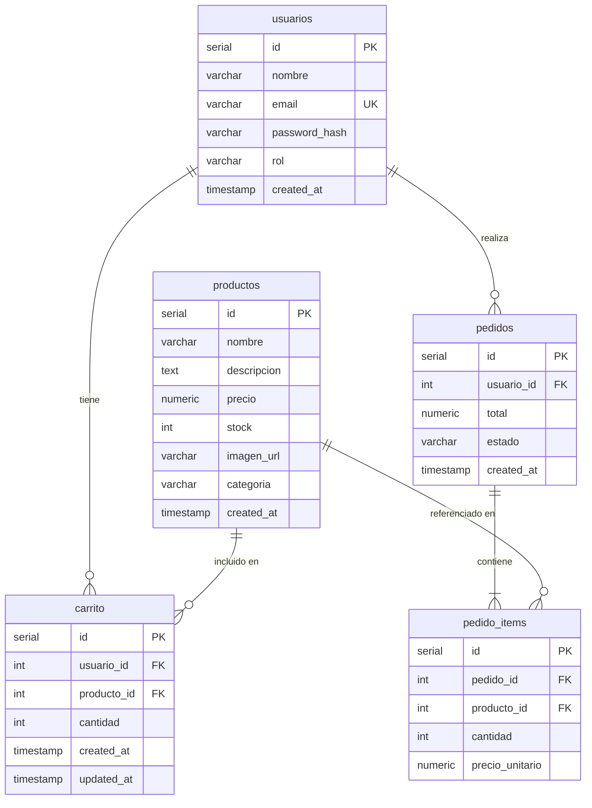

# Diagrama Entidad-Relación: Mini E-Commerce

## Descripción de Relaciones

| Relación | Tipo | Descripción |
|----------|------|-------------|
| usuarios → carrito | 1 a N | Un usuario puede tener múltiples ítems en su carrito |
| productos → carrito | 1 a N | Un producto puede estar en el carrito de múltiples usuarios |
| usuarios → pedidos | 1 a N | Un usuario puede tener múltiples pedidos |
| pedidos → pedido_items | 1 a N (obligatorio) | Un pedido debe tener al menos un ítem |
| productos → pedido_items | 1 a N | Un producto puede estar en múltiples ítems de pedidos |

## Restricciones Especiales

- `carrito`: UNIQUE(usuario_id, producto_id) — un usuario solo puede tener una entrada por producto
- `carrito`: ON DELETE CASCADE desde usuarios y productos
- `pedido_items`: ON DELETE CASCADE desde pedidos
- `pedido_items`: precio_unitario almacena el precio al momento de la compra (histórico)
- `usuarios.rol`: valor por defecto 'cliente', puede ser 'admin'
- `pedidos.estado`: valor por defecto 'pendiente'
